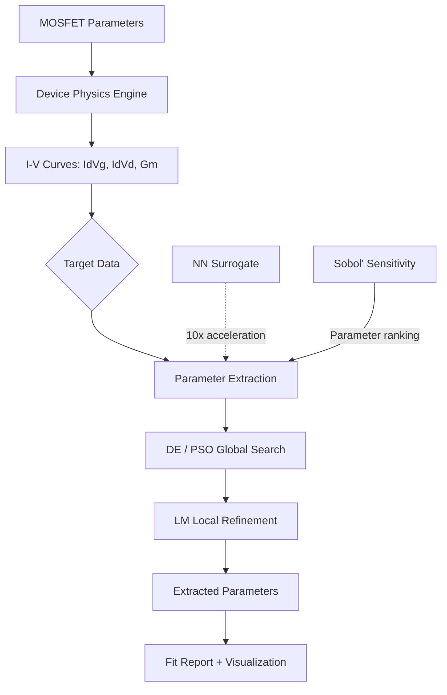

# SPICE Model Parameter Extraction Toolkit

[](https://github.com/veyo-git/spice-model-toolkit/actions/workflows/test.yml)
[](https://www.python.org/)

Semiconductor device SPICE model simulation, parameter extraction, and sensitivity analysis toolkit — bridging physics-based modeling with mathematical optimization and ML.

**Target Role:** SPICE Model Development Engineer (模型研发工程师) — SMIC J12509

---

## Architecture



## Key Features

- **MOSFET Level-1 & Level-3 SPICE models** from first principles
  - Level-1: Shichman-Hodges long-channel (7 params)
  - Level-3: Short-channel with DIBL, velocity saturation, subthreshold (14 params)
- **Multi-strategy optimization engine**
  - Global: Differential Evolution (DE), Particle Swarm (PSO)
  - Local: Trust-Region Reflective (TRF) for fine-tuning
  - Two-stage: Global coarse search → local refinement
- **Multi-curve weighted objective**
  - Id-Vg log-space RMSE (captures 6+ decades)
  - Id-Vd linear-space RMSE
  - Gm peak shape matching
  - Physics-informed penalty terms
- **Sensitivity analysis** — Sobol' variance-based + Morris screening
- **NN surrogate model** — MLP with residual blocks for >10× extraction speedup
- **Interactive Gradio dashboard** — Real-time I-V simulation, extraction, sensitivity

## Quick Start

```bash
git clone https://github.com/veyo-git/spice-model-toolkit.git
cd spice-model-toolkit
pip install -e .

# Run tests
python -m pytest tests/ -v

# Full reproduction
python scripts/reproduce_all.py --quick --skip-surrogate

# Launch dashboard
python -m src.viz.app
```

## Project Structure

```
spice-model-toolkit/
├── src/
│   ├── device/              # Device physics: MOSFET models, I-V curves
│   │   ├── physical.py      # Constants, mobility, threshold voltage
│   │   ├── mosfet.py        # Level-1 & Level-3 SPICE implementations
│   │   └── curves.py        # Id-Vg, Id-Vd, Gm generators
│   ├── extraction/          # Parameter extraction engine
│   │   ├── objective.py     # Multi-curve weighted objective
│   │   ├── optimizer.py     # DE, PSO, LM/TRF optimizers
│   │   └── sensitivity.py   # Sobol' & Morris analysis
│   ├── surrogate/           # ML acceleration
│   │   └── nn_surrogate.py  # NN surrogate for 10× speedup
│   ├── viz/                 # Visualization
│   │   ├── plots.py         # Publication-quality charts
│   │   └── app.py           # Gradio dashboard
│   └── benchmark/           # Standard test cases
│       └── test_cases.py    # 4 benchmark scenarios
├── tests/                   # 41 unit tests
├── notebooks/               # 4 Jupyter tutorials
├── scripts/
│   └── reproduce_all.py     # One-click reproduction
├── README.md
├── README_CN.md
└── requirements.txt
```

## Key Metrics

| Metric | Target |
|--------|--------|
| Parameters extracted | 7 (L1) / 14 (L3) |
| Parameter recovery (within 5%) | >80% |
| Extraction convergence (DE) | <200 iterations |
| NN surrogate speedup | >10× vs physics |
| Id-Vg RMS error | <1% in log space |
| Supported model levels | Level-1 + Level-3 |

## Parameter Extraction Example

```python
from src.device.mosfet import MOSFETLevel3
from src.device.curves import generate_iv_curves
from src.extraction.objective import ExtractionObjective, CurveData
from src.extraction.optimizer import two_stage_extraction

# Generate target data
model = MOSFETLevel3()
id_vg, id_vd = generate_iv_curves(model)

# Build objective
tg_vg = CurveData(vgs=id_vg.vgs, vds=id_vg.vds_values, ids=id_vg.ids)
tg_vd = CurveData(vgs=id_vd.vgs_values, vds=id_vd.vds, ids=id_vd.ids)
obj = ExtractionObjective(target_idvg=tg_vg, target_idvd=tg_vd)

# Two-stage extraction
result = two_stage_extraction(obj, stage1="de")
print(f"Cost: {result['cost_refined']:.6e}")
```

## Optimization Strategy

| Stage | Method | Purpose |
|-------|--------|---------|
| Stage 1 | Differential Evolution | Global coarse search (100-200 iter) |
| Stage 2 | Trust-Region Reflective | Local fine-tuning |

The objective function uses:
- **Log-space RMSE** for Id-Vg (captures subthreshold to strong inversion)
- **Linear-space RMSE** for Id-Vd (focuses on on-state accuracy)
- **Gm peak error** for shape-sensitive matching
- **Physics penalties** to keep parameters in physically meaningful ranges

## Requirements

- Python 3.10+
- NumPy, SciPy, Matplotlib
- PyTorch (for NN surrogate, optional)
- Gradio (for dashboard)
- SALib (for Sobol' analysis, optional)

## License

MIT

---

*Built for semiconductor SPICE model development — where device physics meets optimization.*
