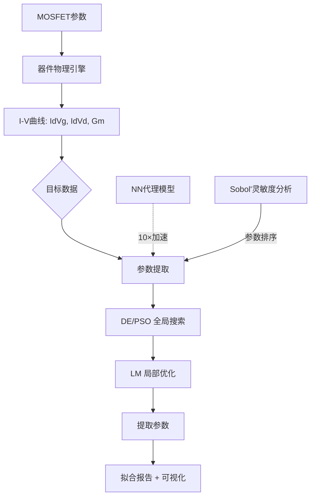

# SPICE模型参数提取工具包

[](https://github.com/veyo-git/spice-model-toolkit/actions/workflows/test.yml)
[](https://www.python.org/)

半导体器件SPICE模型仿真、参数提取与灵敏度分析工具包——将物理建模与数学优化、机器学习相结合。

**目标岗位：** 中芯国际 模型研发工程师 (J12509)

---

## 项目架构



## 核心功能

- **MOSFET Level-1 & Level-3 SPICE模型** — 从第一性原理实现
  - Level-1: Shichman-Hodges长沟道模型（7参数）
  - Level-3: 短沟道效应（DIBL、速度饱和、亚阈值，14参数）
- **多策略优化引擎**
  - 全局搜索：差分进化(DE)、粒子群(PSO)
  - 局部精调：信赖域反射(TRF)
  - 两阶段策略：全局粗搜 → 局部精调
- **多曲线加权目标函数**
  - Id-Vg对数空间RMSE（覆盖6+数量级）
  - Id-Vd线性空间RMSE
  - Gm峰值形状匹配
  - 物理约束惩罚项
- **灵敏度分析** — Sobol'方差分解 + Morris筛选
- **NN代理模型** — 残差MLP架构，>10×提取加速
- **Gradio交互仪表盘** — 实时I-V仿真、参数提取、灵敏度

## 快速开始

```bash
git clone https://github.com/veyo-git/spice-model-toolkit.git
cd spice-model-toolkit
pip install -e .

# 运行测试
python -m pytest tests/ -v

# 一键复现
python scripts/reproduce_all.py --quick --skip-surrogate

# 启动仪表盘
python -m src.viz.app
```

## 项目结构

```
spice-model-toolkit/
├── src/
│   ├── device/              # 器件物理：MOSFET模型、I-V曲线
│   │   ├── physical.py      # 物理常数、迁移率模型、阈值电压
│   │   ├── mosfet.py        # Level-1 & Level-3 SPICE实现
│   │   └── curves.py        # Id-Vg、Id-Vd、Gm曲线生成
│   ├── extraction/          # 参数提取引擎
│   │   ├── objective.py     # 多曲线加权目标函数
│   │   ├── optimizer.py     # DE、PSO、TRF优化器
│   │   └── sensitivity.py   # Sobol' & Morris分析
│   ├── surrogate/           # ML加速
│   │   └── nn_surrogate.py  # NN代理模型
│   ├── viz/                 # 可视化
│   │   ├── plots.py         # 论文级图表
│   │   └── app.py           # Gradio仪表盘
│   └── benchmark/           # 标准测试用例
│       └── test_cases.py    # 4个基准场景
├── tests/                   # 41个单元测试
├── notebooks/               # 4个Jupyter教程
├── scripts/
│   └── reproduce_all.py     # 一键复现脚本
├── README.md
├── README_CN.md
└── requirements.txt
```

## 关键指标

| 指标 | 目标值 |
|------|--------|
| 可提取参数 | 7 (Level-1) / 14 (Level-3) |
| 参数恢复精度（5%误差内） | >80% |
| 提取收敛速度（DE） | <200次迭代 |
| NN代理模型加速比 | >10× |
| Id-Vg RMS误差 | <1%（对数空间） |
| 支持模型层级 | Level-1 + Level-3 |

## 参数提取示例

```python
from src.device.mosfet import MOSFETLevel3
from src.device.curves import generate_iv_curves
from src.extraction.objective import ExtractionObjective, CurveData
from src.extraction.optimizer import two_stage_extraction

# 生成目标数据
model = MOSFETLevel3()
id_vg, id_vd = generate_iv_curves(model)

# 构建目标函数
tg_vg = CurveData(vgs=id_vg.vgs, vds=id_vg.vds_values, ids=id_vg.ids)
tg_vd = CurveData(vgs=id_vd.vgs_values, vds=id_vd.vds, ids=id_vd.ids)
obj = ExtractionObjective(target_idvg=tg_vg, target_idvd=tg_vd)

# 两阶段提取
result = two_stage_extraction(obj, stage1="de")
print(f"代价: {result['cost_refined']:.6e}")
```

## 优化策略

| 阶段 | 方法 | 用途 |
|------|------|------|
| 第一阶段 | 差分进化(DE) | 全局粗搜索（100-200次迭代） |
| 第二阶段 | 信赖域反射(TRF) | 局部精调 |

目标函数设计：
- **对数空间RMSE** — Id-Vg误差（兼顾亚阈值与强反型）
- **线性空间RMSE** — Id-Vd误差（侧重于导通状态精度）
- **Gm峰值误差** — 形状敏感匹配
- **物理惩罚项** — 保持参数在合理物理范围内

## 面试故事线

1. "我有EM仿真基础，理解物理模型→数学方程→数值计算这条链"
2. "量化交易让我精通多参数优化和误差分析"
3. "这个项目展示了从物理方程到优化算法到可视化的全栈能力"
4. "神经网络代理模型代表了AI for EDA的方向，和行业趋势一致"

## 环境依赖

- Python 3.10+
- NumPy, SciPy, Matplotlib
- PyTorch（NN代理模型，可选）
- Gradio（仪表盘）
- SALib（Sobol'分析，可选）

## 许可证

MIT

---

*为半导体SPICE模型研发而构建——器件物理与优化的交汇点。*
